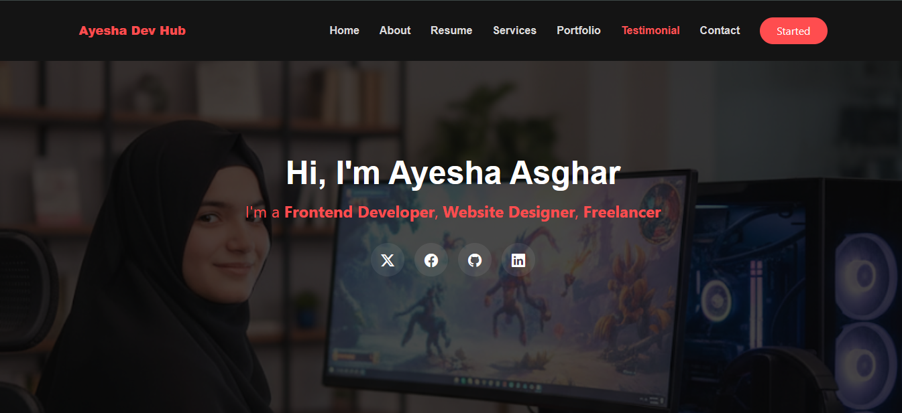

# Ayesha Dev Hub Portfolio



[](https://ayeshadevhuvportfolio.netlify.app/)

## 🚀 Project Overview

A **responsive personal portfolio website** built using **React, Vite, and CSS3**.
Showcases my frontend development work including projects, services, skills, and contact information in a modern and clean design.

**Live Demo:** [ayeshadevhuvportfolio.netlify.app](https://ayeshadevhuvportfolio.netlify.app/)

---

## 🛠️ Features

* Fully **responsive** on mobile, tablet, and desktop
* **Modern UI/UX** with smooth animations
* Sections:

  * Home / Hero
  * About Me
  * Services
  * Portfolio / Projects
  * Contact
* **Component-based** React structure for maintainable code
* Deployed live on **Netlify**

---

## ⚡ Tech Stack

* **Frontend:** React, JavaScript, HTML5, CSS3
* **Build Tool:** Vite
* **Styling:** CSS3 (responsive)
* **Version Control:** Git & GitHub

---

## 🖌️ Folder Structure

```
portfolio/
├─ public/
│  └─ index.html
├─ src/
│  ├─ Components/
│  │  ├─ About.jsx
│  │  ├─ Hero.jsx
│  │  ├─ Navbar.jsx
│  │  ├─ Services.jsx
│  │  ├─ Portfolio.jsx
│  │  └─ Contact.jsx
│  ├─ assets/
│  │  └─ Images/
│  ├─ App.jsx
│  └─ main.jsx
├─ package.json
├─ package-lock.json
├─ vite.config.js
└─ README.md
```

---

## 📦 Installation & Setup

1. Clone the repository:

```bash
git clone https://github.com/ayeshhdeveloper55/Ayesha-dev-hub-Portfolio.git
```

2. Navigate to the project folder:

```bash
cd portfolio
```

3. Install dependencies:

```bash
npm install
```

4. Start the development server:

```bash
npm run dev
```

5. Open the localhost link from the terminal to view locally.

---

## 🌟 Deployment

This portfolio is **live on Netlify**:
[View Live](https://ayeshadevhuvportfolio.netlify.app/)

---

## 💡 Future Enhancements

* Add dynamic project loading via JSON
* Integrate contact form backend
* Add more animations & interactivity
* Optimize images for faster loading

---

## 📫 Contact Me

* **Email:** [ayeshh7766@gmail.com](mailto:ayeshh7766@gmail.com)
* **LinkedIn:** [Ayesha Asghar](https://www.linkedin.com/in/ayesha-asghar-547480332)
* **GitHub:** [ayeshhdeveloper55](https://github.com/ayeshhdeveloper55)

---

> Made with ❤️ by **Ayesha Asghar**

